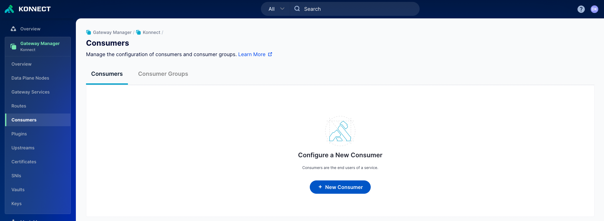
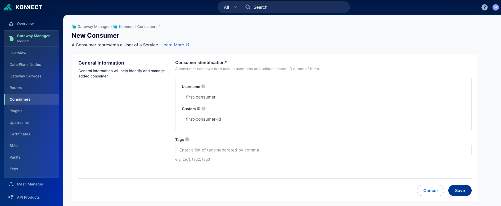
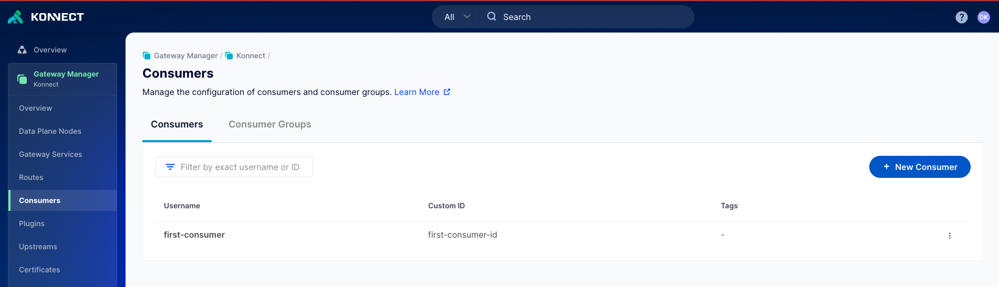

# Add your first Consumer in the Konnect UI

## Video on how to create Consumer in the Konnect UI
<!--

-->

## Add your first Consumer using the the UI

**Pre-Requisites**

1. Access to Konnect Control Plane

**Steps**

1. Log into Konnect Control Plane
2. Navigate to the the runtime group you want to create a consumer for
3. Click on Consumers

4. Click on `+ New Consumer`
5. Configure the `Username` and `Custom ID`

6. Click on Save. Once it's created, you will see the consumer in Konnect

