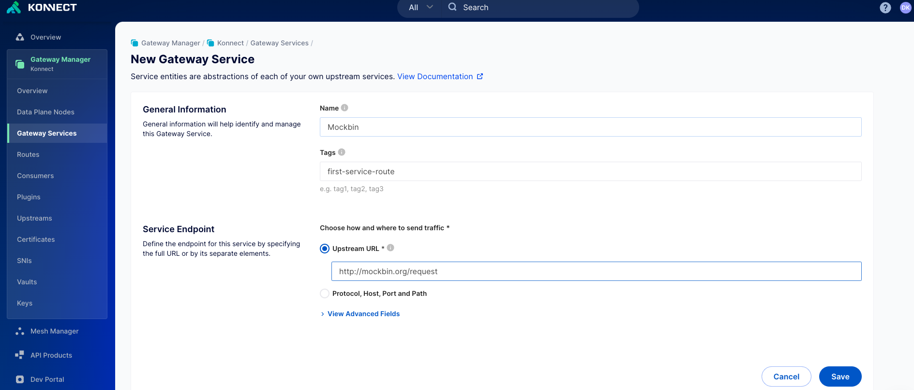
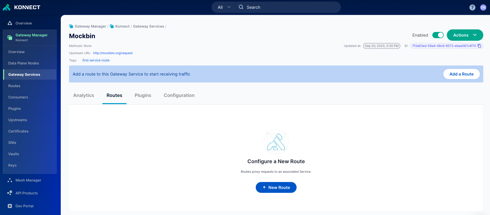
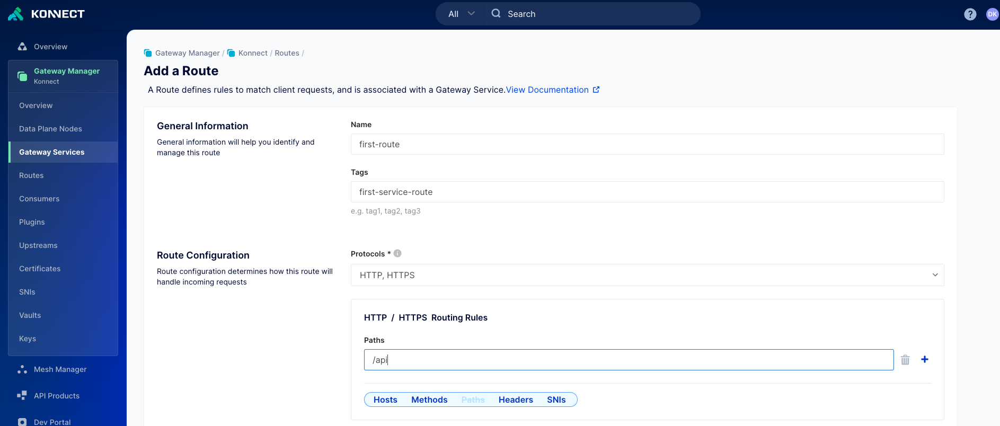
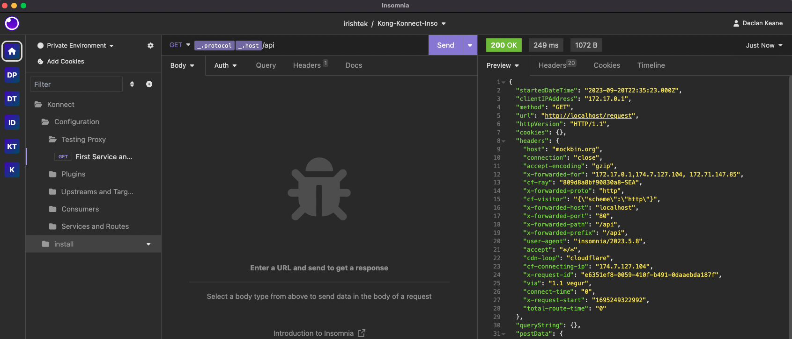
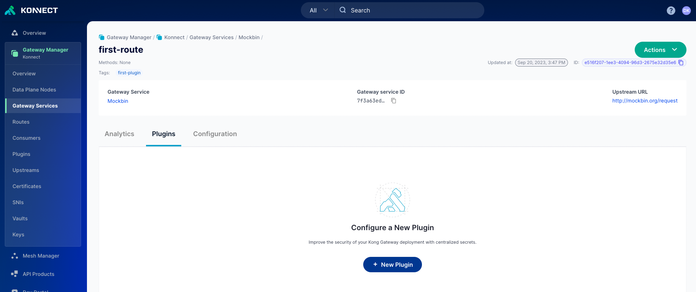
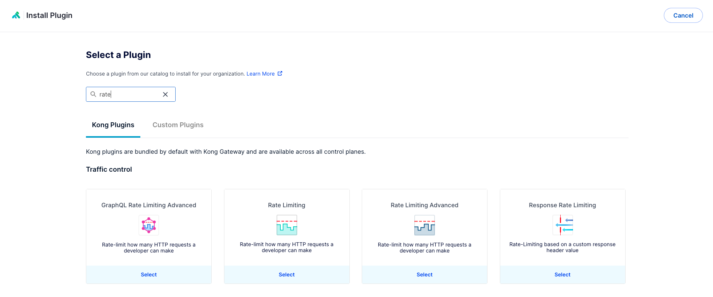
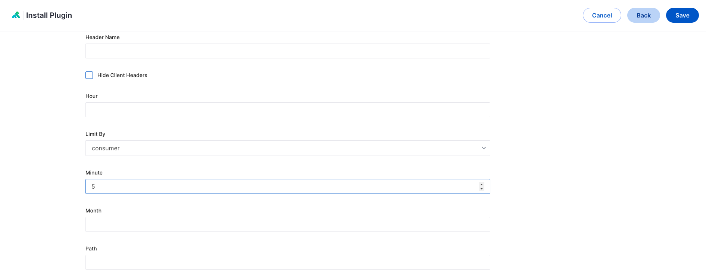

# Add your first [ENTITY] in the Konnect UI

## Video on how to create [ENTITY] in the Konnect UI

<!--
[![Adding new [ENTITY] in KIC](./images/)](https://youtu.be/ "Adding new [ENTITY] in KIC")
-->

# Add your first Plugin in the Konnect UI

**Pre-Requisites**

1. Access to Konnect Control Plane

**Steps**

In this walkthrough we are going to use the Rate limiting plugin to showcase how to add a plugin. The rate limiting plugin limits how many times one can call an API. 

1. Test your proxy endpoint to see if you can get a response back, you should expect a 404 like below

2. Log into Konnect
3. Navigate to the Gateway Manager
4. Select Gateway Services
5. Click on `+ Gateway Service`
6. Configure your service

7. Click on save once you are happy
8. Click on the routes section (not on the left hand side)

9. Configure your route, we will expose the service over /api like

  

10. Go to your proxy endpoint

11. Go to plugin section, and add a plugin

12. Search for rate limiting and select

13. Configure the rate limiting plugin to limit by 5 per minute.

14. Go back to the rate limiting 

15. We can see the rate limiting headers being applied `X-RateLimit-Limit-Minute` and `X-RateLimit-Remaining-Minute`