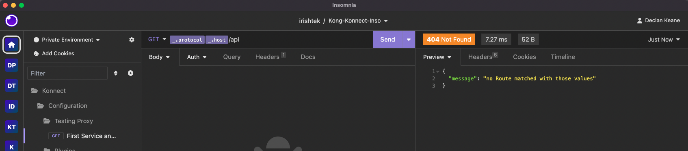

# Deploy your first [ENTITY] using Deck

## Video on how to create [ENTITY] using Deck

<!--
[![Adding new [ENTITY] using Deck](./images/)](https://youtu.be/ "Adding new [ENTITY] using Deck")
-->

## Deploy your first [ENTITY] using Deck

**Pre-Requisites**

1. Gateway/Dataplane/Runtime instance running. Following one of these [guides](../install/) if you have not set it up yet.
2. A [Personal Access token](../deck/create-deck-token-konnect/personal-access-token/) or a [System Access Token](../deck/create-deck-token-konnect/system-access-token/). 
3. Deck is installed. If deck isn't installed, review the documentation [here](https://docs.konghq.com/deck/latest/installation/). This is also outlined [here](../deck/install-deck/) in this github repository. 
4. Rest client, browser or curl access to call the endpoint. 

**Steps**


1. Test your proxy endpoint to see if you can get a response back, you should expect a 404 like below



 
2. Using this directory, you need to add your Personal Access Token either in the command, as an environment variable or in a file. I've saved mine in a file called konnect.key.
3. Run this command to make sure you can talk to the control plane, you should get a successful response:

```
$ deck ping --konnect-token-file konnect.key 
Successfully Konnected to the Kong organization!
```

4. To sync the new configuration, in your terminal:


`deck sync --konnect-token-file konnect.key --konnect-runtime-group-name Konnect --select-tag first-service-route`

5.  Go to your proxy endpoint

