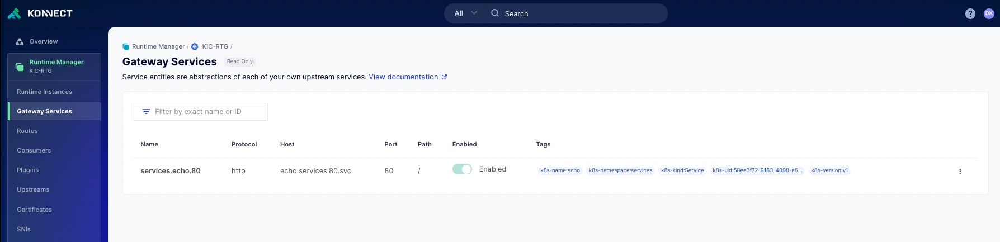
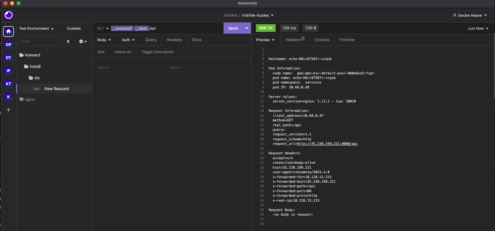

# Deploy your first service in KIC

## Video Guide on how to create a Service and route in KIC

[](https://youtu.be/ "Adding new Service and route in KIC")

## Deploy your first Kong Ingress Resource

**Pre-Requisites**

1. KIC running. Following this [guide]() if you have not set it up
2. Access to Kubernetes Cluster


**Install**

1. Create the namespace: `kubectl create ns services`
2. Create the echo service: `kubectl apply -f echo-service.yaml`
3. Create the ingress: `kubectl apply -f kong-ingress.yaml`

```
$ kubectl get po,svc,ing -n services

NAME                        READY   STATUS    RESTARTS   AGE
pod/echo-68cc97587c-vcqcb   1/1     Running   0          22s

NAME           TYPE        CLUSTER-IP     EXTERNAL-IP   PORT(S)           AGE
service/echo   ClusterIP   10.72.13.199   <none>        8080/TCP,80/TCP   22s

NAME                                          CLASS   HOSTS   ADDRESS          PORTS   AGE
ingress.networking.k8s.io/demo-echo-ingress   kong    *       35.238.199.221   80      16s
```

4. If you log back into Konnect, you will now see the services and routes in Konnect. (Note: The UI will be in read-only mode, you can't)



5. The ingress will expose the echo service over `api`. If you go to the insomnia repo, you will see it available there.



Once you get a response, you should be good to go!