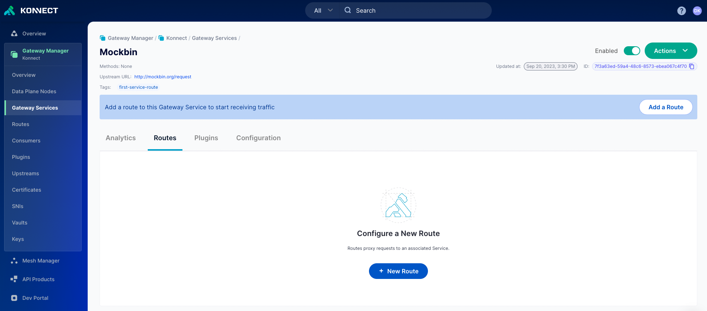
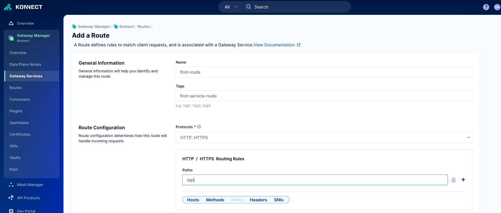

# Add your first Service and Route in the Konnect UI

## Video on how to create Service and Route in the Konnect UI
<!--

-->

## Add your first Service and Route using the the UI

**Pre-Requisites**

1. Access to Konnect Control Plane

**Steps**

1. Test your proxy endpoint to see if you can get a response back, you should expect a 404 like below

2. Log into Konnect
3. Navigate to the Gateway Manager
4. Select Gateway Services
5. Click on `+ Gateway Service`
6. Configure your service

7. Click on save once you are happy
8. Click on the routes section (not on the left hand side)

9. Configure your route, we will expose the service over /api like

  

10. Go to your proxy endpoint

