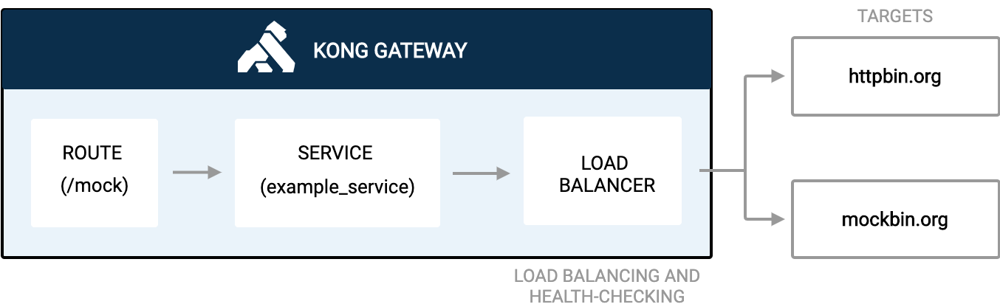
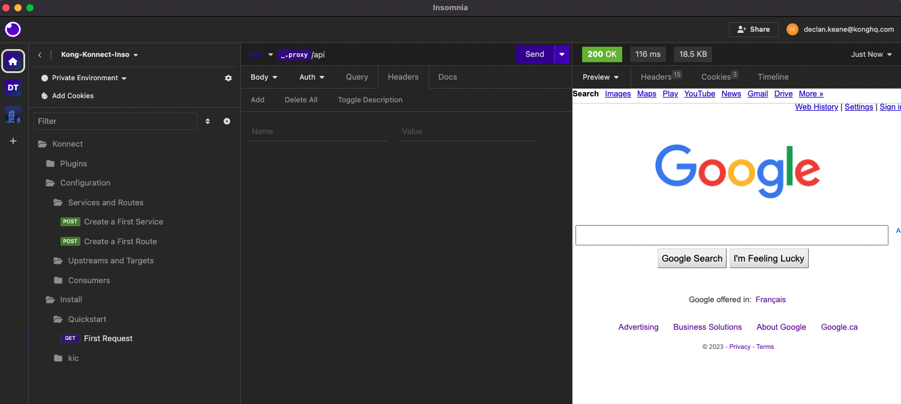
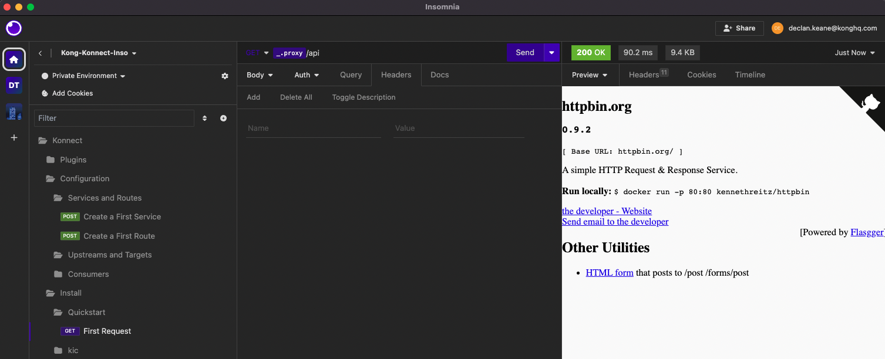

# Working with your first Upstream and Target

In Kong, "Upstreams" and "Targets" are concepts related to load balancing, which is a mechanism for distributing incoming requests across multiple instances of a backend service to improve performance, scalability, and fault tolerance.

**Upstream:**

- An Upstream in Kong represents a group or collection of one or more instances of a backend service. It is essentially a logical entity that defines a set of targets (individual instances of a service) and contains configuration settings related to load balancing.
- Upstreams enable you to group multiple instances of a service under a single umbrella, allowing Kong to distribute incoming requests among them based on a chosen load-balancing algorithm.
- Configuration for an Upstream includes settings such as the load balancing algorithm, health checks, and other parameters.

**Target:**

- A Target is an individual instance of a backend service associated with an Upstream. It represents a specific server or node that can handle requests for a particular service.
- Targets are the actual endpoints where Kong forwards incoming requests for load balancing. Each target is associated with an Upstream, and Kong dynamically distributes traffic among the available targets based on the configured load-balancing algorithm.
- When a request arrives at Kong, it selects a target within the associated Upstream and forwards the request to that target.



**Pre-requisite:** Konnect data plane up and running. If you do not, refer to the [installation guides](../../install/) for setting up Data Planes.

## How to create an Upstream and Target the UI

[Youtube video on creating A Upstream and Target](https://youtu.be/vwrSEZ58fqA?si=oEXDE0K_qD-0wJHm)

## Video on how to create an Upstream and Target using Deck

[Youtube video on creating A Upstream and Target using Deck](https://youtu.be/VJMbFLlSfsc?si=AaP6Yq5S1BSvry9I)

To install this using deck:

1. Navigate to this directory
2. Make sure you have deck [installed](https://docs.konghq.com/deck/latest/installation/)
3. Make sure your konnect token is set `export KONNECT_TOKEN=kpat_abcdedf....................yz`
4. Make sure you can connect: `deck ping --konnect-token $KONNECT_TOKEN` should return a successful response `Successfully Konnected to the Kong organization!`
5. Run deck sync: `deck sync --konnect-token $KONNECT_TOKEN --select-tag first-upstream-target`

```
creating service Upstream-Example
creating upstream upstream-example
creating route Upstream-example
creating target google.com:80 for upstream deebcedd-7be5-4fce-83fb-c954c81603e4
creating target httpbin.org:80 for upstream deebcedd-7be5-4fce-83fb-c954c81603e4
Summary:
  Created: 5
  Updated: 0
  Deleted: 0
```

6. You should now see it toggle between `google.com` and `httpbin.org` when calling the `/api` endpoint for the proxy for 50% of the time.






## Deploy your firstUpstream and Target using the Admin API

You can leverage the insomnia repository [here](https://github.com/irishtek-solutions/kong-konnect-inso) for Admin API usage.

[Youtube video on creating A Upstream and Target using the Konnect Admin API](https://youtu.be/RBwPSnzqEYs?si=rsEOhdPH1VLWm3Im)

## Deploy your firstUpstream and Target using KIC

[Youtube video on creating A Upstream and Target using KIC](https://youtu.be/BmD6OBN8iXw?si=f1g8gz58nOwmMahq)

**Pre-requisite**

Make sure you have Kong Ingress Controller installed and it's working. Follow the installation instructions on the control plane or follow these [instructions](../../install/kic-install/). When running  `kubectl get svc,po -n kong` it should look something like below:

```
$ kubectl get svc,po -n kong

NAME                                         TYPE           CLUSTER-IP     EXTERNAL-IP      PORT(S)                         AGE
service/kong-controller-validation-webhook   ClusterIP      10.23.42.46    <none>           443/TCP                         2m50s
service/kong-gateway-admin                   ClusterIP      None           <none>           8444/TCP                        2m50s
service/kong-gateway-manager                 NodePort       10.23.41.176   <none>           8002:32214/TCP,8445:31304/TCP   2m50s
service/kong-gateway-proxy                   LoadBalancer   10.23.37.74    <ip-address>     80:32018/TCP,443:30662/TCP      2m50s

NAME                                   READY   STATUS    RESTARTS   AGE
pod/kong-controller-65c79f48bf-8vjp5   1/1     Running   0          2m48s
pod/kong-gateway-6bcb9d8d7c-6z8pr      1/1     Running   0          2m48s
```

1. **Install Echo deployment:** `kubectl apply -f 1-create-echo.yaml`
2. **Add Ingress Resource:** `kubectl apply -f 2-echo-ingress.yaml` 
3. **Upstreams and targets get automatically set**
4. **Scale the echo deployment. You'll notice additional targetsb get added automatically:**  `kubectl scale deployment echo --replicas=1 -n testing`