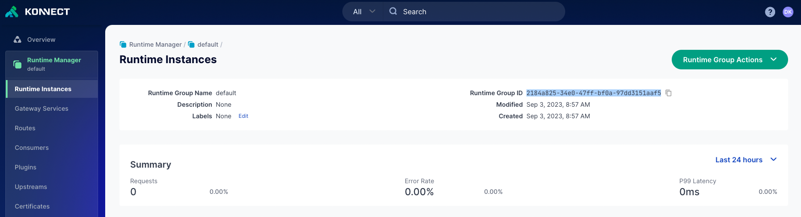

# How to Register for Konnect

[How to get the Konnect Runtime Group ID](#How-to-get-the-Konnect-Runtime-Group-ID) \
[Watch the video instead](#Watch-the-video-instead)

## How to get the Konnect Runtime Group ID

1. Log in to Konnect: `https://cloud.konghq.com/login`
2. Click on Runtime manager
3. Select the runtime group
4. Copy the Runtime Group ID

## Watch the video instead

<!--

>