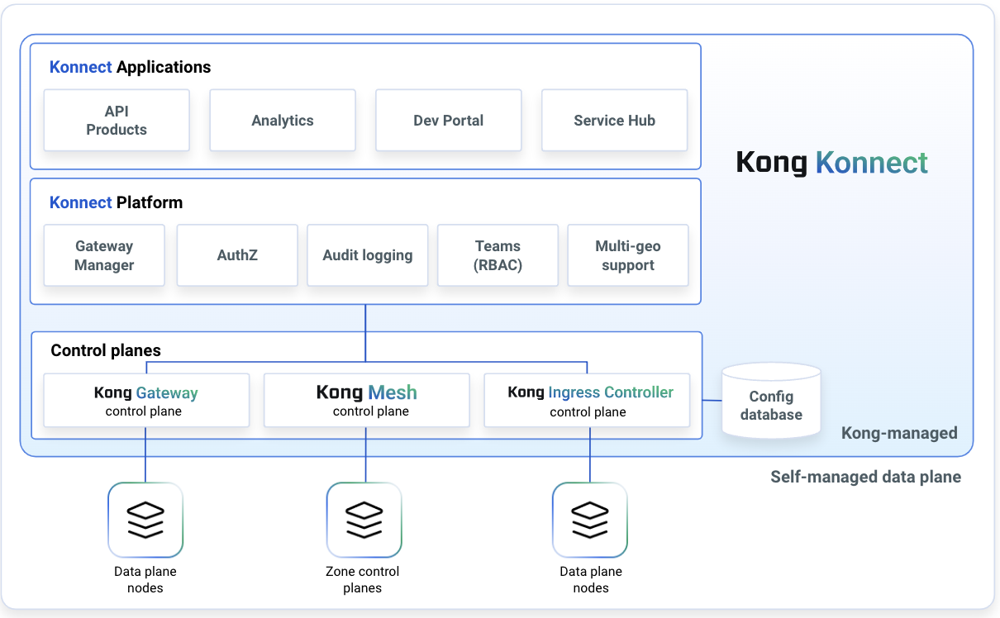

# Overview of Kong Konnect

## Watch video on Overview of Konnect

<!---

-->

## What is Kong Konnect?

Kong Konnect is the unified, cloud-native API lifecycle platform to optimize any environment. Kong Konnect empowers organizations to efficiently publish, consume, secure, analyze and manage APIs and services across modern and legacy applications on any cloud, platform, protocol or architecture. 

## Why kong Konnect?

**Unified API Management Platform:** Kong Konnect is the API management platform that enables businesses to have comprehensive governance and observability across API gateways, Kubernetes footprint, and east-west traffic of service mesh through a single Konnect control plane.

**End-to-end API Lifecycle Management:** Break through API silos, inconsistent compliance to corporate standards and reuse through a central registry of consumable APIs and a platform that supports the entire API lifecycle.

**Federated API Management at scale:** Kong Konnect balances the consistency and governance mandated by the central platform teams with the architectural flexibility desired by the  application teams through a decentralized, template-based approach. Application teams can create control planes based on their own environments and add new developers to specific control planes with consistent role-based access policies.

**Architectural freedom:** You can abstract network and security complexities from services so that developers can focus on building applications instead of integrations. Kong connects services across any cloud, any platform and any modern protocol such as REST, GraphQL, gRPC and Kafka.

**Automation:** Kong Konnect is built with automation and DevOps best practices in mind. By instrumenting your existing CI/CD pipelines using Kong decK, developers are able to generate declarative configuration and keep gateway configurations up-to-date and consistent to accelerate time to market.

**API Consumption:** A detailed record of the requests made to APIs at your fingertips to help API developers understand how their APIs are being consumed and resolve issues faster.

**Extensible:** Leverage the extensive ecosystem of community and commercial plugins to address common use cases such as rate-limiting, authentication and authorization, transformation and many more or develop your own custom plugins.

**Fast and scalable:** Kong Konnect runtimes are lightweight and ultra-fast by
design. You can seamlessly scale up and down services and secure them with policies that enforce IT governance.

**Secure:**  Kong Konnect enables companies to implement robust API security through authentication policies, strong identity & access mgmt and operational insights to comply with security and corporate governance standards. 

## Konnect Components

Kong Konnect includes a control plane and data planes. The global control plane is hosted as a cloud service by Kong, reducing operational risks and lowering the total cost of ownership. The SaaS-based control plane accelerates deployments and provides access to functionality modules.

This video offers an introduction to the Konnect Control plane and gives an overview of each module or component. There are 6 major components:

1. *Gateway Manager:* Catalog, connect to, and monitor the status of all control planes and instances in one place, as well as manage group configuration.
2. *API Products:* Get insights into user behavior for informed decision making and efficient troubleshooting through detailed and near-real time record of the requests made to your APIs.
3. *Developer Portal:* Browse APIs, reference documentation, test endpoints, and register to create applications using specific APIs through a customizable and unified API portal for developers. 
4. *Analytics:* Get a real-time and historical centralized view of all your services with the ability to export to existing security and analytics tools. Monitor golden signals such as traffic, error rate and latency for each service and route to gain deep insights into your API products.
5. *Mesh Manager:* Identify mesh services, manage policies, view relevant metadata (mesh, zone, etc.) and access the service's details
6. *Service Hub:* Coming soon