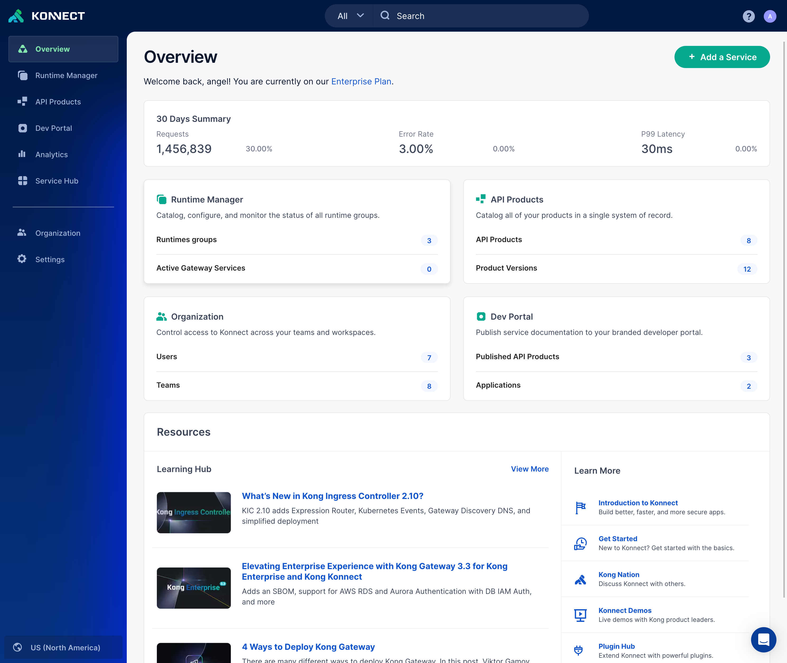

# Product Walkthrough

In this video, we will log into the Control plane and Review the different components of the Control plane. This video will act as a walkthrough of how to navigate through the platform. We will look at how to navigate to and walk through the following different components:

- Runtime Manager/Gateway Manager
- API Products
- Developer Portal
- Analytics
- Mesh Manager
- Service Hub
- Organization sections
- Account details

## Product Walkthrough of Konnect

In this video, we will walk through the different components of Konnect and how to Navigate the UI

<!---

-->