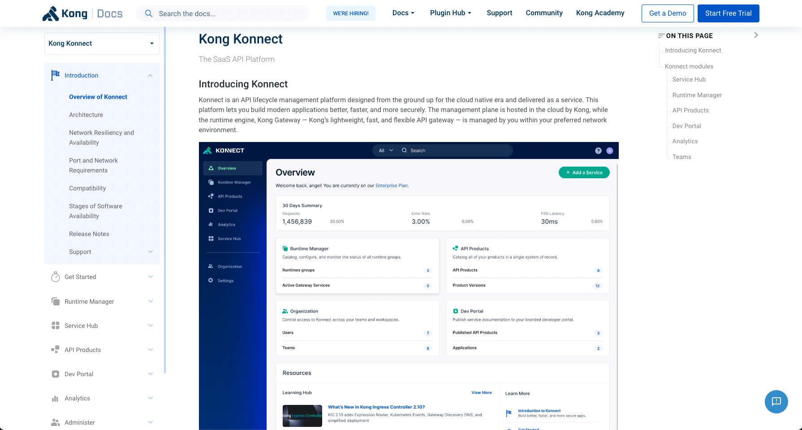

# How to Register for Konnect

To register for Konnect use this link: [Registration Link](https://cloud.konghq.com/register)

## Useful resource links

For full information on Konnect, use the documentation: [Konnect Documentation](https://docs.konghq.com/konnect/) \
List of out of the box available plugins: [Plugin pages](https://docs.konghq.com/hub/) \
Search the Knowledge Base for useful information: [Knowledge base](https://support.konghq.com/support/s/knowledge) \
Kong's education labs offer a free way to set up Kong and learn how to use the platform: [Free learning material](https://education.konghq.com/)

## Watch the video instead

<!---

-->

