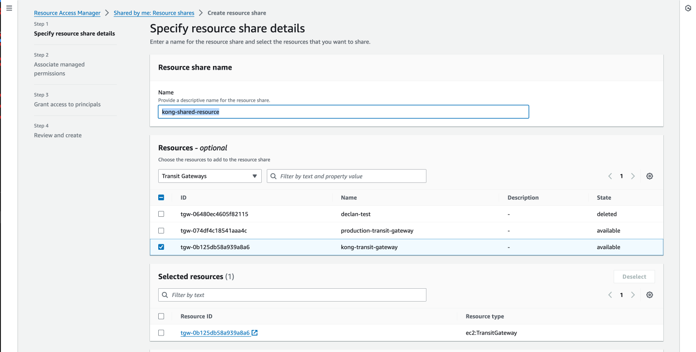

# Dedicated Cloud Gateways

- [Dedicated Cloud Gateways](#dedicated-cloud-gateways)
  - [Prerequisites](#prerequisites)
  - [Part 1: Creating the Konnect Cloud Dedicated Gateways](#part-1-creating-the-konnect-cloud-dedicated-gateways)
  - [Part 2: Create a AWS Transit Gateway](#part-2-create-a-aws-transit-gateway)
  - [Part 3: Configure AWS resources access](#part-3-configure-aws-resources-access)
  - [Part 4: Configure Transit Gateway in Konnect](#part-4-configure-transit-gateway-in-konnect)
  - [Part 5: Accept Transit Gateway attachment request](#part-5-accept-transit-gateway-attachment-request)
  - [Part 6: Make sure VPC in your environment has Transit Gateway attachment](#part-6-make-sure-vpc-in-your-environment-has-transit-gateway-attachment)
  - [Part 7: Add CIDR of Cloud gateways to VPC Route tables](#part-7-add-cidr-of-cloud-gateways-to-vpc-route-tables)
  - [Part 8: Testing with a sample echo service on EC2 instance in the VPC](#part-8-testing-with-a-sample-echo-service-on-ec2-instance-in-the-vpc)
  - [Troubleshooting](#troubleshooting)

## Prerequisites

- A Konnect Control Plane
- An AWS account with administrative privileges to create resources and manage peering

## Part 1: Creating the Konnect Cloud Dedicated Gateways

1. Login to Kong Konnect
2. In the top right, select `New Control Plane`, then select `Kong Gateway`
3. In General Information, provide:
   1. **Name:** `dedicated-cloud-gateways-example`
   2. **[Optional] Description**
   3. **Select** `Dedicated Cloud Instances`
   4. **[Optional] Labels**
4. Select Next

5. In the next screen, select the following:
   1. Version of Kong Gateway: I picked the latest `3.6`
   2. `Autopilot` or `Custom` (I chose Autopilot for this example)
   3. Configure cluster:
      1. Select Provider: `AWS`
      2. Region (I selected one region): `Oregon`
      3. Add a new network or pick existing network. I selected `Add New Network`
         1. Enter a unique name: `dcgw-example`
         2. Select Zone placement
         3. CIDR: `10.0.0.0/16`
      4. Then click on `Save`  
    

    4. The config should now look like below.
    5. Select Public Access or Private. Selected `Public access` in this example.
    6. Click `Create Cluster`

7. When the cluster is created, go to the `Networks` tab, select the 3 dots and `Attach Transit gateway`
8. Copy the AWS Account ID, in this example, it's `099930649125`. This will be used to configure the attachment for the transit gateway.

**Note:** it should take about 30 minutes for a new Network to be created. If the network is already created, then this will only take a couple of minutes. The time needed is for the cloud dataplanes to spin up. Networks are intended to be reused. 

## Part 2: Create a AWS Transit Gateway

1. Log in to AWS
2. Select the same region as cloud gateway network
3. Select VPC > Transit Gateways, then click `Create Transit Gateway`.
4. Name the transit gateway and then click Create Transit Gateway. In this example, it's called `kong-transit-gateway`

5. This will display a Transit Gateway ID, save this. In this example, it is `tgw-0b125db58a939a8a6`.

## Part 3: Configure AWS resources access

1. Go to `Resource Access Manager`, then click `Create Resource Share`.
2. Provide a name `kong-shared-resource`
3. Select Transit Gateways `kong-transit-gateway`as the resource type, and check the box for the transit gateway that you created in the previous section.
4. Select `Next`

5. On the next page, leave `Associate managed permissions` as default. Select `Next` 
6. On the `Grant access to principals` page:
   1. Select `Allow Sharing with anyone`
   2. Enter the AWS account ID (Part 1, bullet point 8). In this example, it was `099930649125`. Select `Add`. Then go to `Next` page.

7. Select `Create resource share`
8. Copy the ARN, in this example, it is `arn:aws:ram:us-west-2:975050302835:resource-share/f5ac65dd-8ec1-442c-9e68-a046bd0ad34d`

## Part 4: Configure Transit Gateway in Konnect

**IMPORTANT:** These need to match, otherwise you will run into connectivity problems connectivity problems.

1. Go to `Networks`, select the three dots and `Attach Transit Gateway`
2. For each configuration
   1. **Transit Gateway Name *(Needs to match the transit gateway name in your AWS Account)*:** `kong-transit-gateway`
   2. **Destination CIDRS *(This needs to match the CIDR of your VPC. My VPC ID is `vpc-0dcd709048de67290`)*:** `172.31.0.0/16`

   

   3. **RAM Share ARN *(copied in part 3, point 8)*:** `arn:aws:ram:us-west-2:975050302835:resource-share/f5ac65dd-8ec1-442c-9e68-a046bd0ad34d` 
   4. 4. **Transit Gateway ID *(part 2, point 5)*:** `tgw-0b125db58a939a8a6` 
   5. **[Optional] DNS config.**
3. Click on `create`, it should look like this:

## Part 5: Accept Transit Gateway attachment request

1. Log back into AWS
2. From the AWS Console, go to VPC > Transit Gateway Attachments.
3. Select the pending request, go to actions and accept

4. It will take a few minutes to be in state `Accepted`
5. Go back to Konnect, Transit Gateway should now be in `Pending Acceptance` state

6. In a few minutes, this should turn to `Ready`

## Part 6: Make sure VPC in your environment has Transit Gateway attachment

If you do not have a VPC attachment in your own environment to your transit gateway, you will not be able to connect to your services.

1. Go to your AWS Account
2. Go to `Transit Gateway Attachments`, then select `Create Transit Gateway attachment`
3. Provide the following configuration:
   1. **Name:** `local-attachment`
   2. **Transit gateway ID:** `tgw-0b125db58a939a8a6`
   3. **Select the VPC ID:** `vpc-0dcd709048de67290`
4. Create the transit gateway attachment

## Part 7: Add CIDR of Cloud gateways to VPC Route tables

1. Go to your AWS Account
2. Go to `VPC`, select VPC `vpc-0dcd709048de67290`, then go to `Route tables`

3. Add the CIDR `10.0.0.0/16` and the correct Transit gateway, `tgw-0b125db58a939a8a6`. 

4. Save changes

## Part 8: Testing with a sample echo service on EC2 instance in the VPC

1. Log in to AWS
2. Setup an EC2 instance, with a simple echo service deployed. Allow the security group to expose the appropiate port. In my example, I was able to call an echo service internally on the EC2 instance over this address: `ip-172-31-22-165.us-west-2.compute.internal`
3. Create a service and route in kong
   1. Service: `http://ip-172-31-22-165.us-west-2.compute.internal`
   2. Route path: `/api`
4. Copy the public edge address. In this example: `https://9611202cec.gateways.konghq.com`

5. You should now be able to call using curl, the endpoint `https://9611202cec.gateways.konghq.com/api` and get a 200 response back. 

## Troubleshooting

Coming..