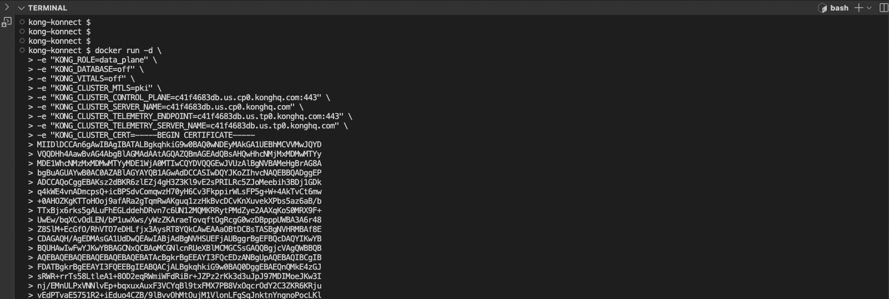

# Install Guide for installing Konnect Gateway using [Install method] 

## Video on Installing Konnect Gateway using [Install method] 

<!--
[](https://youtu.be/ "INSTALL METHOD Install")
-->
## Step by step for installing Konnect Gateway using Docker Quickstart

**Pre-Requisites**

1. Access to Konnect
2. Docker installed locally

**Install Steps**

1. Log into Konnect
2. Go to Gateway Manager
3. Click on the Control Plane (default)
4. Click on `Create A New Data Plane Node`
5. Generate certificates 


6. Copy the script in a terminal and press enter



7. Run `docker container ls`

```
kong-konnect $ docker container ls
CONTAINER ID   IMAGE                   COMMAND                  CREATED          STATUS                             PORTS                                                                          NAMES
84f6b4c687ea   kong/kong-gateway:3.4   "/entrypoint.sh kong…"   12 seconds ago   Up 11 seconds (health: starting)   0.0.0.0:8000->8000/tcp, 8001-8004/tcp, 0.0.0.0:8443->8443/tcp, 8444-8447/tcp   quirky_bouman
```

8. Call the proxy endpoint on port 8000 either using curl or insomnia

`curl http://localhost:8000/`


