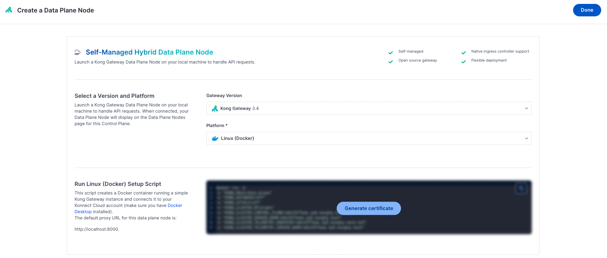
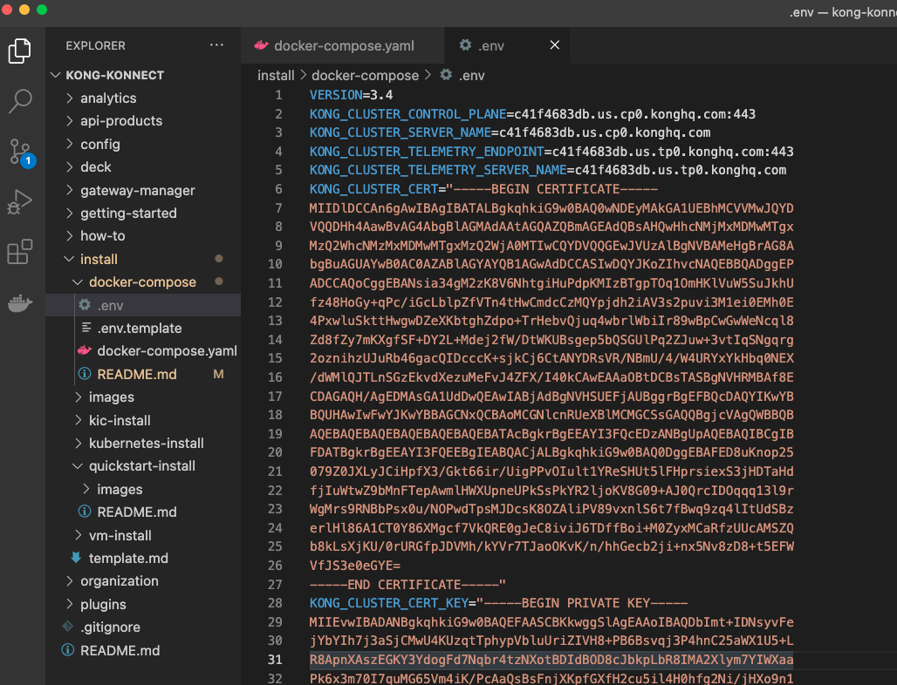

# Install Guide for installing Konnect Gateway using Docker Compose

## Video on Installing Konnect Gateway using Docker Compose

[Link to Youtube Video.](https://www.youtube.com/watch?v=qPcbIEkKZK0)

## Step by step for installing Konnect Gateway using Docker Compose

**Pre-Requisites**

1. Access to Konnect
2. Docker & Docker Compose installed

**Install Steps**

1. Log into Konnect
2. Go to Gateway Manager
3. Click on the Control Plane (default)
4. Click on `Create A New Data Plane Node`
5. Generate certificates 



6. Copy the script so we can get the environment variables.
7. Save the `.env.template` file in this directory as `.env `
8. Paste the environment variables from what was copied in step 6 into the .env file. It should look like this:



9. In this directory, run `docker-compose up -d`
10. Run `docker container ls`

```
kong-konnect $ docker container ls
CONTAINER ID   IMAGE                   COMMAND                  CREATED          STATUS                             PORTS                                                                          NAMES
84f6b4c687ea   kong/kong-gateway:3.4   "/entrypoint.sh kong…"   12 seconds ago   Up 11 seconds (health: starting)   0.0.0.0:8000->8000/tcp, 8001-8004/tcp, 0.0.0.0:8443->8443/tcp, 8444-8447/tcp   quirky_bouman
```

11. Call the proxy endpoint on port 8000 either using curl or insomnia

`curl http://localhost:8000/`


9.  Call the proxy endpoint on port 8000 either using curl or insomnia

`curl http://localhost:8000/`

the response should look something like this:

```
{
	"message": "no Route matched with those values"
}
```

The result is that we now have a fully working and connected Data Plane that we can now start to work on.


