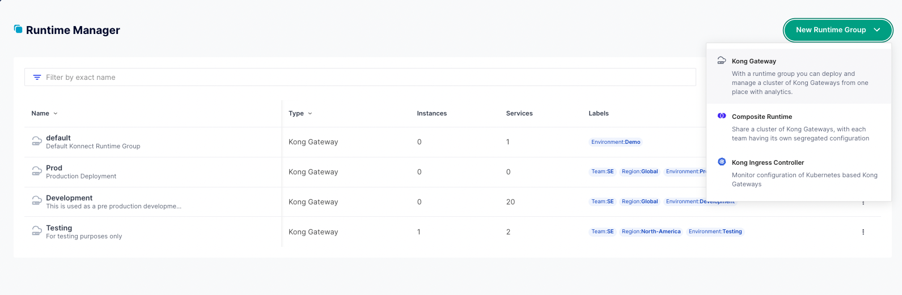
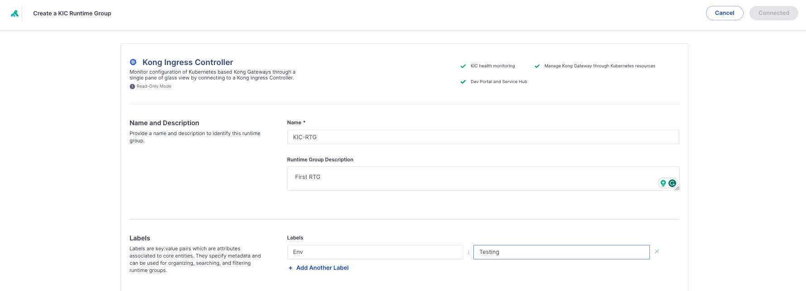
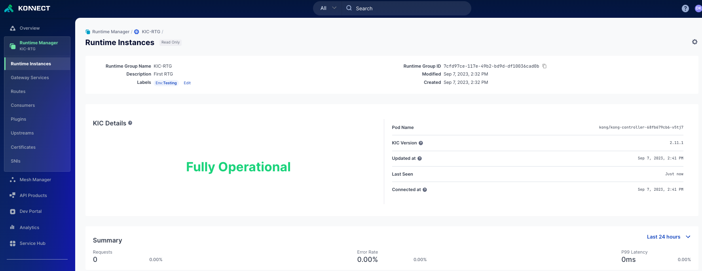
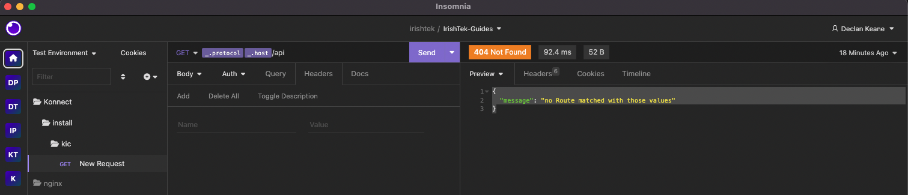

# Install Guide for Konnect KIC 

## Video on Installing KIC with Kong Konnect

<!--
[KIC Install)])
-->
## Steps for installing KIC with Kong Konnect

**Pre-Requisites**

1. Access to Konnect
2. Kubernetes cluster access

**Install Steps**

1. Log into Konnect
2. Select `Gateway Manager` > `New Control Plane`
3. Select `Kong Ingress Controller`



4. Configure the New Runtime group by adding a name



5. Select `Generate Script`
6. Follow the instructions provided by the `Generate Script` option.
7. Run the following command `kubectl get po,svc -n kong` to see if everything is up and running:

```
$ kubectl get po,svc -n kong
NAME                                   READY   STATUS    RESTARTS   AGE
pod/kong-controller-5cdcb48d8d-g68s2   1/1     Running   0          121m
pod/kong-gateway-7dd9576dbb-j8lfx      1/1     Running   0          121m

NAME                                         TYPE           CLUSTER-IP   EXTERNAL-IP   PORT(S)                      AGE
service/kong-controller-validation-webhook   ClusterIP      10.72.1.27   <none>        443/TCP                      121m
service/kong-gateway-admin                   ClusterIP      None         <none>        8444/TCP                     121m
service/kong-gateway-proxy                   LoadBalancer   10.72.5.81   34.30.5.211   80:31346/TCP,443:30677/TCP   121m
```

8. Go back to Konnect to verify everything is working



9. Check to see if the proxy would work. The `EXTERNAL-IP` address can be used to konnect to the KIC runtime instance. You should get the following response

```
{
	"message": "no Route matched with those values"
}
```



10. **To test your first proxy request install the Echo deployment:** `kubectl apply -f 1-create-echo.yaml`
11. **Add Ingress Resource:** `kubectl apply -f 2-echo-ingress.yaml`
12. **Proxy request to your proxy endpoint**