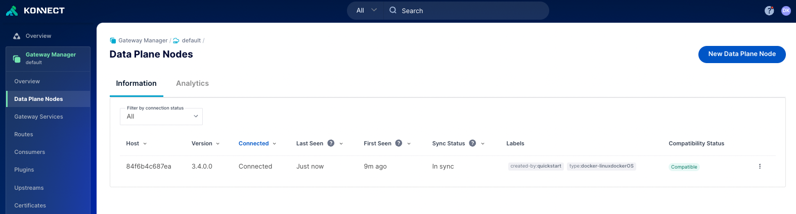

# Install Guide for installing Konnect Gateway using Kubernetes install 

## Video on Installing Konnect Gateway using Kubernetes install 


[Video on Konnect Kubernetes Install]()

## Step by step for installing Konnect Gateway using Kubernetes install option

**Pre-Requisites**

1. Access to Konnect
2. Kubernetes cluster access
3. helm 3 installed

**Install Steps**

1. Connect to your Kubernetes cluster. In my example I'm connecting to a GKE cluster (could be any cluster)

`gcloud container clusters get-credentials cluster-1 --zone us-central1-c --project sales-engineering-scratch`

2. Run a basic command to make sure you can connect. Like `kubectl get namespace`.

```
$ kubectl get namespace
NAME              STATUS   AGE
default           Active   6d7h
gmp-public        Active   6d7h
gmp-system        Active   6d7h
kube-node-lease   Active   6d7h
kube-public       Active   6d7h
```
3. Log into Konnect and got to `Gateway Manager` and then `default` Control plane
4. Select `Create a new Data Plane Node`  
5. From the drop-down list select `Kubernetes`

6. Follow the instructions as provide. The first will be to create a namespace, add the helm chart, update helm :

- `kubectl create namespace kong`
- `helm repo add kong https://charts.konghq.com`
- `helm repo update`

7. Next you need to generate the certificates and save them locally. `tls.crt` for the cluster certificate and then`tls.key` for the certificate key. 
8. Next you need to create the secret fir the certificate and key pair. Run `kubectl create secret tls kong-cluster-cert -n kong --cert=./tls.crt --key=./tls.key` . If you run `kubectl get secrets -n kong` you should see the secrets
9. Save the values.yaml locally in a `values.yaml` file.
10. Run the helm install command `helm install my-kong kong/kong -n kong --values ./values.yaml`

11. You should see it running like here in your terminal:
    
```
$ kubectl get svc,po -n kong

NAME                                         TYPE           CLUSTER-IP     EXTERNAL-IP      PORT(S)                         AGE
service/kong-controller-validation-webhook   ClusterIP      10.23.42.46    <none>           443/TCP                         2m50s
service/kong-gateway-admin                   ClusterIP      None           <none>           8444/TCP                        2m50s
service/kong-gateway-manager                 NodePort       10.23.41.176   <none>           8002:32214/TCP,8445:31304/TCP   2m50s
service/kong-gateway-proxy                   LoadBalancer   10.23.37.74    <ip-address>     80:32018/TCP,443:30662/TCP      2m50s

NAME                                   READY   STATUS    RESTARTS   AGE
pod/kong-controller-65c79f48bf-8vjp5   1/1     Running   0          2m48s
pod/kong-gateway-6bcb9d8d7c-6z8pr      1/1     Running   0          2m48s
```


12.  It should also be connected to in the Control plane



