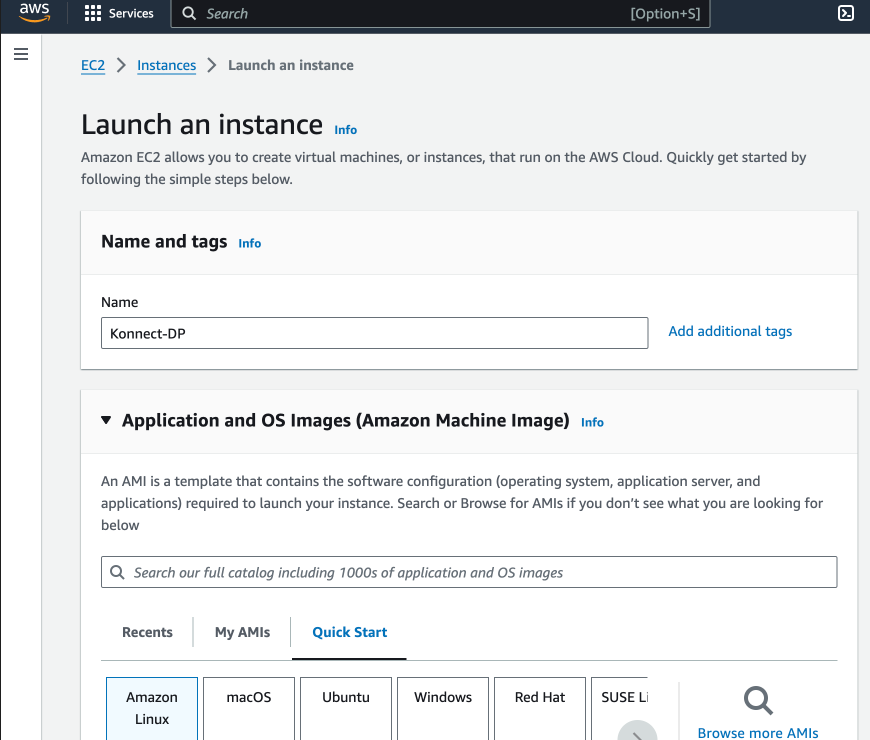

# Install Guide for installing Konnect Gateway using Virtual Machine (VM)

## Video on Installing Konnect Gateway using Virtual Machine (VM)

[Part 1 - EC2 Instance Install](https://youtu.be/mtxH0pbWn78)

[Part 2 - Install Konnect DP on EC2](https://youtu.be/DAO7Eqg_J-A)

## Step by step for installing Konnect Gateway using Virtual Machine (VM)

**Pre-Requisites**

1. Access to the Konnect Control plane
2. AWS Account Access
3. Ability to SSH to an EC2 instances
4. A supported system with root or root-equivalent access.

**Install Steps**

### Part 1: Creating the VM in AWS

1. Log into AWS
2. Go to EC2 services by searching in the search bar
3. Click on "Launch Instance" in the region you would like
4. Provide a name, in my case I'm calling it "Konnect-DP"



5. The other configuration options you need to provide::
-  Using Amazon Linux 2023 AMI
-  Because this is a demo, using `t2.micro` instances
-  If you don't have a key pair, create a new one. 
-  I will be creating a security group. But you can use an existing one.
-  Allow SSH, HTTP and HTTPS traffic from the internet also.  
- Allow public IP Address


6.  I will then launch the instance. It will take some time to setup the instance. Once it’s up and running you should now see the instance in a “Running state”.


### Part 2: Connecting to the VM

1. Connect to the VM how you would usually. I will be using the terminal on my Mac to connect using SSH.
2. As an example:

```
ssh -i "<your-key>.pem" ec2-user@<ec2-address>
```
3. You should get the following:

```
 $ ssh -i "<key>.pem" ec2-user@<ec2-instance>
   ,     #_
   ~\_  ####_        Amazon Linux 2023
  ~~  \_#####\
  ~~     \###|
  ~~       \#/ ___   https://aws.amazon.com/linux/amazon-linux-2023
   ~~       V~' '->
    ~~~         /
      ~~._.   _/
         _/ _/
       _/m/'
Last login: Tue Feb 20 00:38:24 2024 from 174.x.x.x
```

4. Change to root user: `sudo su`
5. Run `yum update`

### Part 3: Installing the Konnect Data Plane

1. Log into the Konnect Control Plane
2. Click on `New Data Plane`
3. Select the `gateway version` and the platform you would like to use. In our case, we will choose `Linux`


4. We will then need to install Kong. As there are a number of different linux options, we will choose `Amazon Linux 2` from this [link](https://docs.konghq.com/gateway/latest/install/)

5. Copy the yum commands in the install instructions. As an example, here are the download instructions

```
curl -1sLf "https://packages.konghq.com/public/gateway-36/config.rpm.txt?distro=amzn&codename=$(rpm --eval '%{amzn}')" | sudo tee /etc/yum.repos.d/kong-gateway-36.repo > /dev/null
sudo yum -q makecache -y --disablerepo='*' --enablerepo='kong-gateway-36'
```

6. Here is the install instructions:

```
sudo yum install -y kong-enterprise-edition-3.6.0.0
```

7. We will then navigate back to Konnect. We will generate the certificate and key required to connect to the control plane.
8. Create a new certificate file and paste the certificate in the contents: `vi /etc/ssl/certs/tls.crt`

9. Create a new key file and paste the key in the contents: `vi /etc/ssl/certs/tls.key`

10. Make a copy of the default configuration:`cp /etc/kong/kong.conf.default /etc/kong/kong.conf`

11. Update your kong configuration in `vi /etc/kong/kong.conf` directory
11. It should look something like this. Note I've modified/added the `proxy_listen` settings:

```
role = data_plane
database = off
cluster_mtls = pki
cluster_control_plane = xxx.us.cp0.konghq.com:443
cluster_server_name = xxx.us.cp0.konghq.com
cluster_telemetry_endpoint = xxx.us.tp0.konghq.com:443
cluster_telemetry_server_name = xxx.us.tp0.konghq.com
cluster_cert = /etc/ssl/certs/tls.crt
cluster_cert_key = /etc/ssl/certs/tls.key
lua_ssl_trusted_certificate = system
konnect_mode = on
vitals = off
proxy_listen = 0.0.0.0:80 reuseport backlog=16384, 0.0.0.0:443 http2 ssl reuseport backlog=16384
```

12. Start kong by running `kong start`

### Part 4: Verify Konnect Data plane is working correctly

1. Navigate to the `Gateway Manager` section of Konnect


2. Add a service and route in Konnect

3. Go to a browser and enter the public address of the gateway and the path it is available over.


