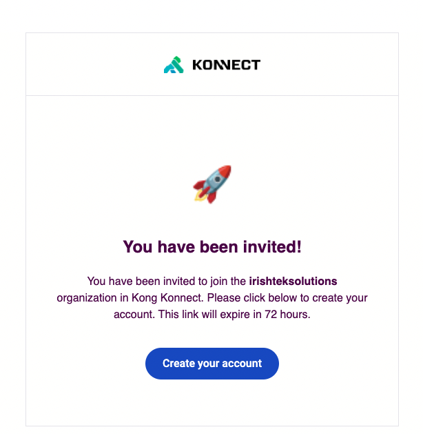
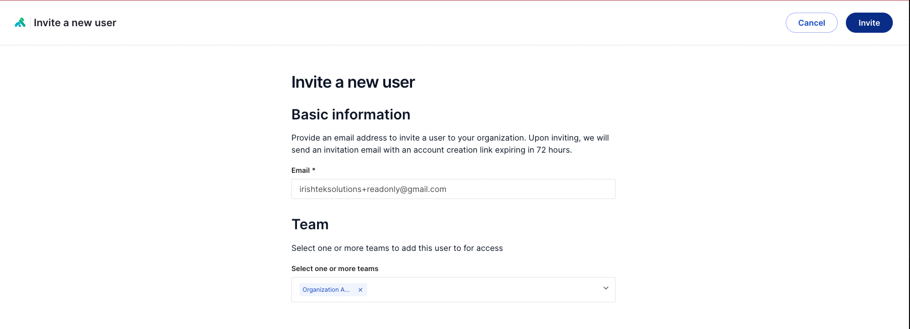

# How to create a new Admin in Konnect

[Watch the video to create a new Admin](#Watch-the-video-to-create-a-new-Admin) \
[How to create a new Admin in Konnect](#How-to-create-a-new-Admin-in-Konnect)

## Watch the video to create a new Admin

## How to create a new Admin in Konnect

1. Log in to Konnect: `https://cloud.konghq.com/login`
2. Go to the Organization section in Konnect
3. Select User
4. Select `+ Invite`

5. User will then receive an email to activate the account. 
   

6. Activate the account by clicking on the link

