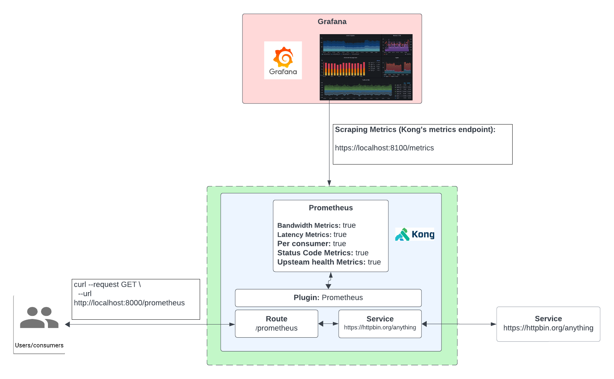

# How to use the Prometheus Plugin

- [How to use the Prometheus Plugin](#how-to-use-the-prometheus-plugin)
  - [What is Prometheus?](#what-is-prometheus)
  - [Plugin Installation using Deck](#plugin-installation-using-deck)
  - [Plugin Installation using Admin API](#plugin-installation-using-admin-api)
  - [Plugin Installation using KIC](#plugin-installation-using-kic)
  - [Prometheus and Grafana Installation](#prometheus-and-grafana-installation)
  - [Wrapping up](#wrapping-up)

## What is Prometheus?

Prometheus metrics or Prometheus metrics scraping involves collecting and exposing various performance and operational metrics about the API in a specific format. The advantage of it being in a specific format would be that other tools can support ingestion of this format.

**How it works with Konnect**

1. Create a Service and Route
2. Test to see if we can proxy request
3. Enable Kong’s Prometheus Plugin
4. Setup Grafana to scrape metrics
5. Send some requests through on the proxy endpoint
6. Check Grafana to see metrics




 
<!-- ## Watch the video on how to use the Prometheus plugin -->

<!--
[![First [PLUGIN NAME]](./images/activate.png)](https://youtu.be/ "First [PLUGIN NAME]")
-->

## Plugin Installation using Deck

To install the Prometheus Plugin using deck:

1. Navigate to this directory
2. Make sure you have deck [installed](https://docs.konghq.com/deck/latest/installation/)
3. Make sure your konnect token is set `export KONNECT_TOKEN=kpat_abcdedf....................yz`
4. Make sure you can connect: `deck gateway ping --konnect-token $KONNECT_TOKEN` should return a successful response `Successfully Konnected to the Kong organization!`
5. Run deck sync: `deck gateway sync --konnect-token $KONNECT_TOKEN --select-tag prometheus-example`

## Plugin Installation using Admin API

You can leverage the insomnia repository [here](https://github.com/irishtek-solutions/kong-konnect-inso) for Admin API usage.

## Plugin Installation using KIC

**Pre-requisite**

Make sure you have Kong Ingress Controller installed and it's working. Follow the installation instructions on the control plane or follow these [instructions](../../install/kic-install/). When running  `kubectl get svc,po -n kong` it should look something like below:

```
$ kubectl get svc,po -n kong

NAME                                         TYPE           CLUSTER-IP     EXTERNAL-IP      PORT(S)                         AGE
service/kong-controller-validation-webhook   ClusterIP      10.23.42.46    <none>           443/TCP                         2m50s
service/kong-gateway-admin                   ClusterIP      None           <none>           8444/TCP                        2m50s
service/kong-gateway-manager                 NodePort       10.23.41.176   <none>           8002:32214/TCP,8445:31304/TCP   2m50s
service/kong-gateway-proxy                   LoadBalancer   10.23.37.74    <ip-address>     80:32018/TCP,443:30662/TCP      2m50s

NAME                                   READY   STATUS    RESTARTS   AGE
pod/kong-controller-65c79f48bf-8vjp5   1/1     Running   0          2m48s
pod/kong-gateway-6bcb9d8d7c-6z8pr      1/1     Running   0          2m48s
```

1. **Install Echo deployment:** `kubectl apply -f 1-create-echo.yaml` 
2. **Add Ingress Resource:** `kubectl apply -f 2-echo-ingress.yaml`
3. **Note: `konghq.com/plugins: <plugin-name>` ingress annotation is already present for the plugin**
4. **Proxy to the endpoint:** Using insomnia or `curl http://<kong-proxy-endpoint>:<port>/prometheus`
5. **Add the plugin resource:** `kubectl apply -f 3-prometheus-plugin.yaml`
6. **Proxy to the endpoint, plugin is now enabled:** Using insomnia or `curl http://<kong-proxy-endpoint>:<port>/prometheus`

## Prometheus and Grafana Installation

>Before we can install Prometheus and Grafana we need to alter the base Data Plane [installation](https://github.com/irishtek-solutions/kong-konnect/tree/main/install). No matter what deployment model we use, we will need add an additional environment variable so that the Data Plane correctly exposes the metrics endpoint. We do this by adding `KONG_STATUS_LISTEN=0.0.0.0:8100` or `KONG_STATUS_LISTEN: "0.0.0.0:8100"`to the values.yaml or docker-compose.yaml, respectively.

####Prometheus

For this installation we will be using docker-compose to stand up the Prometheus server. We will need the docker-compose.yaml and the prometheus.yml to build the container to run Prometheus. First edit prometheus.yml to add our machines IP Address to the `scrape config` at line 5 

```yaml
scrape_configs:
  - job_name: 'kong'
    scrape_interval: 5s
    static_configs:
      - targets: ['<LOCAL_MACHINE_IP_ADDRESS>:8100'] #CHANGE ME 
```

Run `docker-compose up`, the Prometheus image will download and the container will start up in about 30 seconds.


####Grafana

To install Grafana, we will execute their docker run command found in  [Grafana's installation docs](https://grafana.com/docs/grafana/latest/setup-grafana/installation/docker/).

```bash
docker run -d -p 3000:3000 --name=grafana grafana/grafana-enterprise
```

Just like Prometheus in the previous section, the grafana image will downloaded and the container will start.


Once Grafana has started, we need to create the Prometheus datasource and import the Kong dashboard. Navigate to `localhost:3000` to find the Grafana UI, log in using the default un/pw `admin/admin`, click the the three bar menu icon, and then choose "Data Sources" towards the botton of the menu.


Click the big blue "Add data source" button, select Prometheus, and then under "Connection" add our Local Machine IP Address and the Prometheus port - `http:://IP_ADDRESS:9090`


Scroll down, click "Save and Test", and we get the green success response.


Scroll back to the top, and click "Build a dashboard" on the far right.


Select "Import Dashboard" on the bottom right and on the following page drag and drop the `kong_dashboard.json` from the `/dashboards` directory. Once it imports, click the dropdown input under "Prometheus" and select our created dashboard and "Import". We will be directed to the Kong (official) dashboard. You can expand the widgets to see the dashboard layout. 


Now that we've installed and connected Prometheus and Grafana, we can send traffic to Kong: `curl http://<kong-proxy-endpoint>:<port>/prometheus` and we will see our traffic appear in the Grafana dashboard. It helps to set the time range to "Last 5 minutes":


## Wrapping up

Thanks for going through this Prometheus/Grafana tutorial. If you'd like to see more guided examples of how to configure Kong Plugins please refer to the [plugin section](https://github.com/irishtek-solutions/kong-konnect/tree/main/plugins) for more.