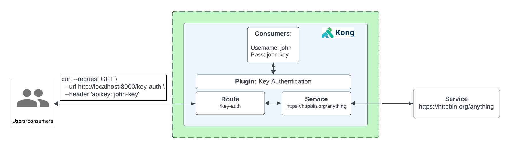

# How to Use the Key Authentication Plugin

- [How to Use the Key Authentication Plugin](#how-to-use-the-key-authentication-plugin)
  - [What is the Key Authentication?](#what-is-the-key-authentication)
  - [Watch the video on how to use the Key Authentication plugin](#watch-the-video-on-how-to-use-the-key-authentication-plugin)
  - [Installation using Deck](#installation-using-deck)
  - [Installation using Admin API](#installation-using-admin-api)
  - [Installation using KIC](#installation-using-kic)

## What is the Key Authentication?

**Key authentication:** also known as API key authentication or token-based authentication, involves using a unique API key or token to authenticate and authorize access to an API. When a client sends a request to an API, they include their API key in the request (typically via a header). When it comes to Key Authentication and using it at the Gateway, the API gateway then validates the key and grants access if it's valid.

**How to do it with Konnect**

1. Create a Service and Route
2. Test to see if we can proxy request with a key or no key
3. Enable Kong’s Key Authentication Plugin
4. Try to access the API now. We will not be able to access the API.
5. Create a consumer in Kong
6. Provision that Consumer a Key
7. Test the API with the newly create key credential



## Watch the video on how to use the Key Authentication plugin

[Youtube video on Key Authentication Plugin](https://youtu.be/ORhip-Stcs4?si=A9p2wWW2skOd2OBv)

## Installation using Deck

To install this using deck:

1. Navigate to this directory
2. Make sure you have deck [installed](https://docs.konghq.com/deck/latest/installation/)
3. Make sure your konnect token is set `export KONNECT_TOKEN=kpat_abcdedf....................yz`
4. Make sure you can connect: `deck ping --konnect-token $KONNECT_TOKEN` should return a successful response `Successfully Konnected to the Kong organization!`
5. Run deck gateway sync: `deck gateway sync --konnect-token $KONNECT_TOKEN --select-tag key-auth-example`

## Installation using Admin API

You can leverage the insomnia repository [here](https://github.com/irishtek-solutions/kong-konnect-inso) for Admin API usage.

## Installation using KIC

**Pre-requisite**

Make sure you have Kong Ingress Controller installed and it's working. Follow the installation instructions on the control plane or follow these [instructions](../../install/kic-install/). When running  `kubectl get svc,po -n kong` it should look something like below:

```
$ kubectl get svc,po -n kong

NAME                                         TYPE           CLUSTER-IP     EXTERNAL-IP      PORT(S)                         AGE
service/kong-controller-validation-webhook   ClusterIP      10.23.42.46    <none>           443/TCP                         2m50s
service/kong-gateway-admin                   ClusterIP      None           <none>           8444/TCP                        2m50s
service/kong-gateway-manager                 NodePort       10.23.41.176   <none>           8002:32214/TCP,8445:31304/TCP   2m50s
service/kong-gateway-proxy                   LoadBalancer   10.23.37.74    <ip-address>     80:32018/TCP,443:30662/TCP      2m50s

NAME                                   READY   STATUS    RESTARTS   AGE
pod/kong-controller-65c79f48bf-8vjp5   1/1     Running   0          2m48s
pod/kong-gateway-6bcb9d8d7c-6z8pr      1/1     Running   0          2m48s
```

1. **Install Echo deployment:** `kubectl apply -f 1-create-echo.yaml`
2. **Add Ingress Resource:** `kubectl apply -f 2-echo-ingress.yaml` 
3. **Note: `konghq.com/plugins: <plugin-name>` ingress annotation is already present for the plugin**
4. **Proxy to the endpoint:** Using insomnia or `curl http://<kong-proxy-endpoint>:<port>/key-auth`
5. **Add the plugin resource:** `kubectl apply -f 3-key-auth-plugin.yaml`
6. **Proxy to the endpoint, plugin is now enabled:** Using insomnia or `curl http://<kong-proxy-endpoint>:<port>/key-auth`
7. **Create a credential secret for consumer "John", with key "john-key" :** `kubectl apply -f 4-create-credentials.yaml`
8. **Create a consumer called "john" who has the credential created in the previous step:** `kubectl apply -f 5-create-consumer.yaml `
9. **Test to see if you can now get access to the API by using credentials:** Using insomnia or curl:

```
curl --request GET \
  --url http://35.188.198.126/key-auth \
  --header 'apikey: john-key'
```