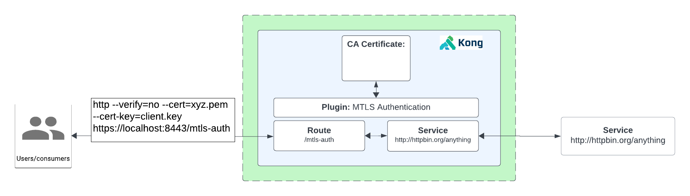

# How to Use the Mutual TLS Authentication

- [How to Use the Mutual TLS Authentication](#how-to-use-the-mutual-tls-authentication)
  - [What is Mutual TLS Authentication?](#what-is-mutual-tls-authentication)
  - [Watch the video on how to use the Mutual TLS Authentication plugin](#watch-the-video-on-how-to-use-the-mutual-tls-authentication-plugin)
  - [Installation using Deck](#installation-using-deck)
  - [Installation using Admin API](#installation-using-admin-api)
  - [Installation using KIC](#installation-using-kic)

## What is Mutual TLS Authentication?

**Mutual TLS Authentication:** Mutual TLS authentication is a method by which clients send a certificate with their request to authenticate with an API. The certificate follows the X.509 standard.

Inluded in this directory is the CA certificate in PEM format in file ca.cert.pem.  The clietn certificate is 1337.pem and its key is in client.key.

**How to do it with Konnect**

1. Create a Service and a Route.
2. Test to see if we can proxy request via HTTPS
3. Create a CA certificate and sign a client certificate using it.
3. Enable Kong’s Mutual TLS Authentication Plugin
4. Validate failure without using a certificate
5. Validate success when using a valid and accepted certificate



## Watch the video on how to use the Mutual TLS Authentication plugin

[Youtube video on Mutual TLS Authentication Plugin](https://youtu.be/ZZqDEZjxRYM)

## Installation using Deck

To install this using deck:

1. Navigate to this directory
2. Make sure you have deck [installed](https://docs.konghq.com/deck/latest/installation/)
3. Make sure your konnect token is set `export KONNECT_TOKEN=kpat_abcdedf....................yz`
4. Make sure you can connect: `deck gateway ping --konnect-token $KONNECT_TOKEN` should return a successful response `Successfully Konnected to the Kong organization!`
5. Run deck gateway sync: `deck gateway sync --konnect-token $KONNECT_TOKEN --select-tag mutual-tls-auth-example --konnect-control-plane-name $CP-HERE`

The kong.yaml file contains the CA certificate, Service, Route and Plugin.  The plugin is disabled to start, except for KIC.

The client certificate is in file 1337.pem, and the key is in client.key

## Installation using Admin API

You can leverage the insomnia repository [here](https://github.com/irishtek-solutions/kong-konnect-inso) for Admin API usage.

## Installation using KIC

**Pre-requisite**

Make sure you have Kong Ingress Controller installed and it's working. Follow the installation instructions on the control plane or follow these [instructions](../../install/kic-install/). When running  `kubectl get svc,po -n kong` it should look something like below:

```
$ kubectl get svc,po -n kong

NAME                                         TYPE           CLUSTER-IP     EXTERNAL-IP      PORT(S)                         AGE
service/kong-controller-validation-webhook   ClusterIP      10.23.42.46    <none>           443/TCP                         2m50s
service/kong-gateway-admin                   ClusterIP      None           <none>           8444/TCP                        2m50s
service/kong-gateway-manager                 NodePort       10.23.41.176   <none>           8002:32214/TCP,8445:31304/TCP   2m50s
service/kong-gateway-proxy                   LoadBalancer   10.23.37.74    <ip-address>     80:32018/TCP,443:30662/TCP      2m50s

NAME                                   READY   STATUS    RESTARTS   AGE
pod/kong-controller-65c79f48bf-8vjp5   1/1     Running   0          2m48s
pod/kong-gateway-6bcb9d8d7c-6z8pr      1/1     Running   0          2m48s
```

1. **Install Echo deployment:** `kubectl apply -f 1-create-echo.yaml`
2. **Add a CA certificate** 'kubectl create secret generic my-ca-cert --from-literal=id=c30df703-efe9-43cc-bf1b-8246581b740d --from-file=cert=./ca.cert.pem
$ kubectl label secret my-ca-cert 'konghq.com/ca-cert=true'
$ kubectl annotate secret my-ca-cert 'kubernetes.io/ingress.class=kong'
3. **Add the plugin resource:** `kubectl apply -f 2-mtls-auth-plugin.yaml`
4. **Add Ingress Resource:** `kubectl apply -f 3-echo-ingress.yaml`
5. **Proxy to the endpoint using http** http --verify=no --cert=./1337.pem --cert-key=./client.key https://host:port/mtls-auth`
