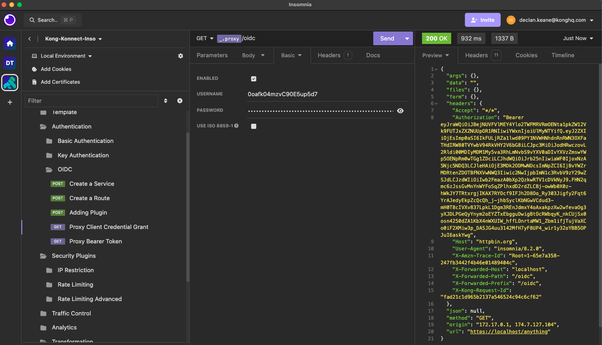

# OpenID Connect Plugin

- [OpenID Connect Plugin](#openid-connect-plugin)
  - [What is OpenID Connect?](#what-is-openid-connect)
  - [What IDP does Kong support and what will be used in these examples?](#what-idp-does-kong-support-and-what-will-be-used-in-these-examples)
  - [Watch the video on how to use the OpenID Connect plugin](#watch-the-video-on-how-to-use-the-openid-connect-plugin)
    - [Setting up the OKTA Application and Authorization Server](#setting-up-the-okta-application-and-authorization-server)
      - [Part 1: Setting up the Application](#part-1-setting-up-the-application)
      - [Part 2: Creating a Custom Authorization Server](#part-2-creating-a-custom-authorization-server)
    - [Part 3 Create a Custom Scope for our Authorization Server\*\*](#part-3-create-a-custom-scope-for-our-authorization-server)
    - [Authorization Code Flow Example](#authorization-code-flow-example)
    - [Client Credential Grant](#client-credential-grant)
    - [Bearer Access Token Example](#bearer-access-token-example)
    - [Authorization based on Claims](#authorization-based-on-claims)

## What is OpenID Connect?

Full documentation on the OIDC plugin is located [here](https://docs.konghq.com/hub/kong-inc/openid-connect/).

OpenID Connect (OIDC) is an authentication layer on top of the OAuth 2.0 protocol. It allows clients to verify the identity of an end-user based on the authentication performed by an authorization server, as well as to obtain basic profile information about the end-user in an interoperable and REST-like manner. OIDC introduces an identity layer on top of OAuth 2.0, utilizing JSON Web Tokens (JWT) to secure the identity information transferred during the authentication process.

Kong Konnect has an OpenID Connect plugin you can use and leverage it for a number of different reasons: 

**Authentication:** The OIDC plugin can authenticate users against an external Identity Provider (IDP) before allowing access to your APIs. This process typically involves redirecting the user to the IDP for authentication, then receiving an ID token and possibly an access token after successful authentication.

**Authorization:** Beyond authenticating users, the OIDC plugin can also handle authorization by inspecting scopes and claims within the ID token or access tokens to make fine-grained access control decisions.

**Centralized User Management:** By delegating authentication to an external IDP, Kong allows for centralized user management, making it easier to handle user information and access across multiple services and applications.

**Security:** The OIDC plugin helps secure your APIs by ensuring that only authenticated and authorized users can access your services. It also supports additional security measures like token encryption and validation.

**Additional Capabilities:** the plugin also has the ability to extract information from the tokens, while also having the ability to map specific claims in the token to a consumer entity in Kong Konnect where you do more advanced policy enforcement.

## What IDP does Kong support and what will be used in these examples?

The Kong OIDC plugin is designed to be generic and should work with any IDP that conforms to the OpenID Connect standard. Some of the widely used IDPs include:

1. *Google:* Offers OpenID Connect services for authenticating users with Google accounts.
2. *Azure Active Directory (Azure AD):* Microsoft's cloud-based identity and access management service.
3. *Okta:* A popular identity platform that provides cloud software to manage employee and customer identities.
4. *Auth0*: Provides authentication and authorization as a service, supporting custom user databases, social login, and more.
5. *Keycloak:* An open-source identity and access management solution aimed at modern applications and services.
6. *Amazon Cognito:* A service that provides authentication, authorization, and user management for web and mobile applications.

## Watch the video on how to use the OpenID Connect plugin

The IDP I will pick for these examples will be OKTA. However you should be able to use any Identity provider that supports OpenID Connect. There are some nuances with every provider. But in general, it should be similar

- [MISSING video on setting up OIDC (OKTA) Application]()
- [Youtube video Authorization Code Flow Example](https://www.youtube.com/watch?v=Va1jYy4zlqo)
- [Youtube video Client credential grant flow](https://youtu.be/k-EdbnHjvzs)
- [Youtube video Bearer Token Example](https://youtu.be/k-EdbnHjvzs)
- [Youtube video Authorization based on Claims](https://youtu.be/DgVquyx2Cbs)

### Setting up the OKTA Application and Authorization Server

#### Part 1: Setting up the Application

1. Sign Up or Log In to Okta. If you don't have access, create a developer account for testing here: https://developer.okta.com/signup/
2. Access the Okta Developer Dashboard
3. Go to the Application section and Create a New Application Integration:

- Select `OIDC - OpenID Connect`
- Select `Web Application`


4. Fill in details for the new application

- **App integration name:** Kong Konnect Proxy OIDC
- **Grant Type:**
  - Client Credentials
  - Authorization Code
- **Sign in redirects:**
  - http://localhost:8000/oidc
- **Sign-out redirects:**
  - http://localhost:8000/oidc

5. In the Assignments section, for controlled access, choose your preferred access level for this application. This preferred access level sets the permissions for Okta admins. As his is just an example, I will set it to `Allow everyone in your organization to access`. 

6. Click on `Save`
7. Once it's created, copy the Client ID and Secret. We will need this later. As an example:

-  `Client ID:` 0oafk04mzvC90E5up5d7
-  `Secret:` 5B50DI....xxx

#### Part 2: Creating a Custom Authorization Server

1. Add an Authorization Server. From the left sidebar, go to `Security` > `API` > `Authorization Server` and create a server named `Kong Konnect API Management` with an `Audience` called `kong` and description. Click Save. On the page that appears, note the Issuer address. You need this address to configure the Kong OIDC Plugin


2. Now add a policy from the Access Policies tab.
    
- Click Add `New Access Policy` and add a Name and Description
- Add a rule
- Assign a Rule Name and use the default settings, or adjust to your requirements.
- Click Create Rule


3. Then add the rule. You can leave everything as default


   
### Part 3 Create a Custom Scope for our Authorization Server**

If using the default authorization server, you do not need to do the following. If using a custom Authorization server, you do. The reason being is that for OKTA:

```
The preconfigured scopes for a new Okta Authorization Server assume there is a user context associated with the flow which will not be the case with Client Credentials (machie-to-machine). In most cases API services that accept tokens minted with a Client Credentials flow would be expecting custom scope(s) of some type that dictate the access that token has for the service.
```

This is required for using it with 
`Bearer Access Token` or `Client Credential Grant`.

1. Go to `Security` > `API` 
2. Click on the custom `Authoirzation Server`. I called mine `Kong Konnect API Management`
3. Go to the `Scopes` tab and click `Add scopes`
4. Provide input as the following. The custom scope will be called `custom_scope`:


6. Click on Create

### Authorization Code Flow Example

Now that our application in OKTA is setup, lets see if we can setup the OIDC to proxy to our API.


1. Create a route and service
2. Add the OIDC plugin to the service
3. For the OIDC plugin configuration, configure the following on the common tab:

- **Issuer (Discovery Document URI):** `https://{YOUR_OKTA_DOMAIN}/oauth2/{YOUR_AUTH_SERVER}/.well-known/openid-configuration` .The issuer URL can be found in your Authorization Server settings.
- **Client ID:** Populate the client ID shown in your Okta application’s General page. We copied this earlier.
- **Client Secret:** Populate the client secret shown in your Okta application’s General page.We copied this earlier.
- **Auth Methods:** Authorization code flow
  


4. Go to your browser. You should now be able to test and log in when you go to `http://kong-proxy-address.com/oidc`. In my case `http://localhost:8000/oidc`. Enter in your credentials. You should now be able to get access. 

### Client Credential Grant

Important: You need to have a custom scope if using a non-default Authorization Server.

1. Create a route and service
2. Add the OIDC plugin to the service
3. For the OIDC plugin configuration, configure the following on the common tab:

- **Issuer:** `https://{YOUR_OKTA_DOMAIN}/oauth2/{YOUR_AUTH_SERVER}/.well-known/openid-configuration` .Yhe issuer URL can be found in your Authorization Server settings.
- **Client ID:** Add the client ID shown in your Okta application’s General page.
- **Client Secret:** Add with the client secret shown in your Okta application’s General page.
- **Auth Methods:** Client Credentials Grant

4. **On the Advanced:** for config.scopes, add `custom_scope` only
5. **Using insomnia** send a request to the endpoint using baseic auth. This is a sample curl command:

```
curl --request GET \
  --url http://localhost:8000/oidc \
  --header 'Authorization: Basic <base64 encoded client_id:client_secret>' \
  --header 'User-Agent: insomnia/8.2.0'
```



### Bearer Access Token Example

Important: You need to have a custom scope if using a non-default Authorization Server.

1. Create a route and service
2. Add the OIDC plugin to the service
3. For the OIDC plugin configuration, configure the following on the common tab:

- **Issuer:** `https://{YOUR_OKTA_DOMAIN}/oauth2/{YOUR_AUTH_SERVER}/.well-known/openid-configuration` .Yhe issuer URL can be found in your Authorization Server settings.
- **Client ID:** Add the client ID shown in your Okta application’s General page.
- **Client Secret:** Add with the client secret shown in your Okta application’s General page.
- **Auth Methods:** Bearer Access Token

4. **On the Advanced:** for config.scopes, add `custom_scope` only

5. **Next step is to test.** 
 
Lets call OKTA directly to get a token. As an example:

```
curl --request POST \
  --url https://<okta-endpoint>/oauth2/<auth-server>/v1/token \
  --header 'Content-Type: application/x-www-form-urlencoded' \
  --data grant_type=client_credentials \
  --data scope=custom_scope \
  --data client_id=<client-id> \
  --data client_secret=<client-secret
```

this should return a token like this:

```
{
	"token_type": "Bearer",
	"expires_in": 3600,
	"access_token": "eyJraWQiOiJBejNUVFVlMEY4Ylo2TWFMRVRmOENta1pkZW12Vk9FUTJxZXZNUUpOR1RNIiwiYWx..........X",
	"scope": "custom_scope"
}
```

We can use the `access_token` to make a call to the oidc endpoint
```
curl --request GET \
  --url http://localhost:8000/oidc \
  --header 'Authorization: Bearer <insert-access-token>'
```
### Authorization based on Claims

Now that we have the plugin set up with one of the authentication methods like `Authorization Code Flow`, `Client Credential Grant` or `Bearer Token` flow. Lets see if we can Authorize the request based on a claim.

1. Lets log in using authorization code flow and do an inspection on the token using JWT.io
2. As we can see we have some attributes or claim tied to my user. In this example. I can see I have a `aud` or audience claim of `kong`


3. Lets update the plugin to limit access based on the `aud` claim. Go to the authorization tab for the plugin. Lets update `Audience Required` with a claim we do not have. Lets say `facebook`. Save the config and try to access the request. You will now get a forbidden error.


