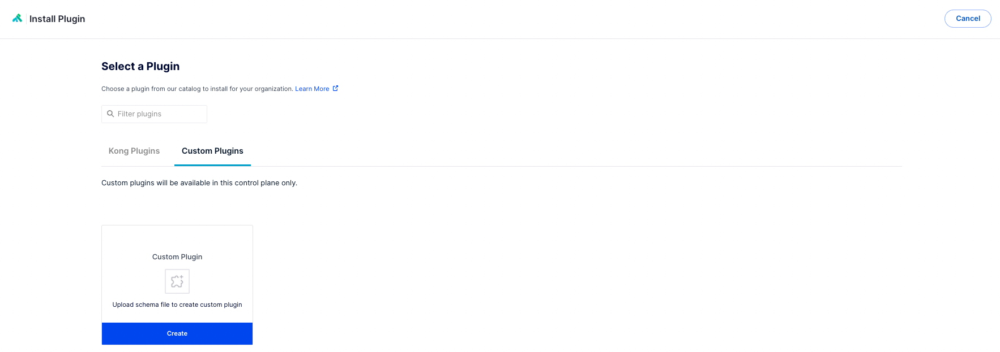
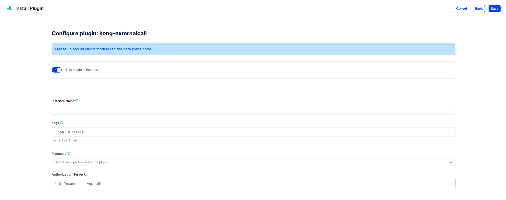

# External Authentication Endpoint Custom Plugin

`NOTE: This is an example only. This plugin should NOT be used in production.`

## Video for adding external Authentication Endpoint Custom Plugin in Konnect

Click on [youtube link](https://youtu.be/utqH-zGzReY?si=zKmrv-WabErynC2j) to view how this custom plugin works.

## Step by step for adding this custom plugin with Konnect

This custom plugin lets you call an external `http` authentication endpoint to validate credentials passed through the gateway. The he 

In this directory, there is a folder called `kong-externalcall` which contains the code for our custom plugin. The directory structure looks like this:

```
.
├── README.md
├── docker-compose.yaml
├── kong-externalcall
│   └── plugin
│       ├── handler.lua
│       └── schema.lua
└── kong.Dockerfile
```

The two important files for the custom plugin:

1. `handler.lua`: The handler is the Lua module that contains the logic for your plugin. It defines how Kong will process requests and/or responses when the plugin is applied. In the provided example for a custom header plugin, the handler is responsible for adding a custom header to the outgoing request.
   
2. `schema.lua`: When a user adds your plugin to a service, route or globally, they can provide values for the configuration parameters specified in the schema. In the example below for a custom header plugin, the schema defines two configuration parameters: header_name and header_value. Users can configure these parameters when applying the plugin to a service or route.

**Pre-Requisites**

1. Access to Konnect
2. Docker & Docker Compose installed

**Creating a custom image with the plugin installed**

1. Log into Konnect
2. Go to Gateway Manager
3. Click on the Control Plane (default)
4. Click on `Create A New Data Plane Node`
5. Generate certificates 


6. Copy the script so we can get the environment variables.
7. Save the `.env.template` file in this directory as `.env `
8. Paste the environment variables from what was copied in step 6 into the .env file. It should look like this:


NOTE: It's important to note you need to set `KONG_UNTRUSTED_LUA: "on"`  & `KONG_UNTRUSTED_LUA_SANDBOX_REQUIRES: resty.http` in your docker-compose file. This is already set in the template.

9. In this directory, run `docker-compose up -d`. By running this command it will build a new docker image using the `kong.Dockerfile` and use that image in our Kong Konnect dataplane proxy. 
10. Run `docker container ls`

```
$ docker container ls
CONTAINER ID   IMAGE                                    COMMAND                  CREATED         STATUS                            PORTS                                                                          NAMES
d19c3e0cc6f7   calling-external-auth-endpoint-kong-dp   "/entrypoint.sh kong…"   7 seconds ago   Up 7 seconds (health: starting)   0.0.0.0:8000->8000/tcp, 8001-8004/tcp, 0.0.0.0:8443->8443/tcp, 8444-8447/tcp   calling-external-auth-endpoint-kong-dp-1
```

11.   Call the proxy endpoint on port 8000 either using curl or insomnia

`curl http://localhost:8000/`

the response should look something like this:

```
{
	"message": "no Route matched with those values"
}
```

**Add the schema to the control plane**

1. Log into the control plane
2. Navigate to the plugin section
3. Select `+ new plugin`. You should see the following screen:



4. Click on `Create`
5. Add the schema 
6. You should now see the custom plugin available as an option to select



**Testing the plugin**

1. Create a service pointing to `http://httpbin.org/anything` and route exposing the service over `/api`
2. Proxy a request through, you should get a response, 

```
$ curl localhost:8000/api

{
  "args": {}, 
  "data": "", 
  "files": {}, 
  "form": {}, 
  "headers": {
    "Accept": "*/*", 
    "Host": "httpbin.org", 
    "User-Agent": "curl/7.79.1", 
    "X-Amzn-Trace-Id": "Root=1-655bf264-0ef7d67406f9a7102bb7650b", 
    "X-Forwarded-Host": "localhost", 
    "X-Forwarded-Path": "/api", 
    "X-Forwarded-Prefix": "/api", 
    "X-Kong-Request-Id": "f6b81a6633812b082a49ed4dd3760308"
  }, 
  "json": null, 
  "method": "GET", 
  "origin": "172.24.0.1, 174.7.127.104", 
  "url": "https://localhost/anything"
}
```

3. Add the new plugin on the service, you can leave the options as default or configure them


4. Specify the endpoint that you want to call out to for token/key authentication. If you send a request with a valid token, you will get a `200` response. If its invalid, you will get a `401` ot `403` response. 

```
$ curl localhost:8000/api
{
  "args": {}, 
  "data": "", 
  "files": {}, 
  "form": {}, 
  "headers": {
    "Accept": "*/*", 
    "Host": "httpbin.org", 
    "User-Agent": "curl/7.79.1", 
    "X-Amzn-Trace-Id": "Root=1-655bf38d-4a43b24f09e049d9260e4f54", 
    "X-Forwarded-Host": "localhost", 
    "X-Forwarded-Path": "/api", 
    "X-Forwarded-Prefix": "/api", 
    "X-Kong-Request-Id": "17d9425b7f44172046bd5a642f002e79"
  }, 
  "json": null, 
  "method": "GET", 
  "origin": "172.24.0.1, 174.7.127.104", 
  "url": "https://localhost/anything"
}
```