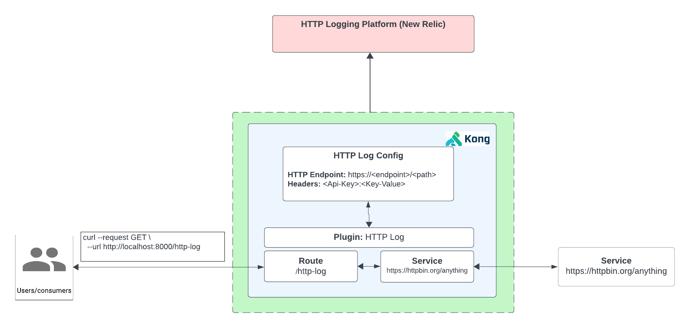

# How to use the HTTP Logging Plugin

- [How to use the HTTP Logging Plugin](#how-to-use-the-http-logging-plugin)
  - [What is the HTTP Logging?](#what-is-the-http-logging)
  - [Watch the video on how to use the HTTP Logging plugin](#watch-the-video-on-how-to-use-the-http-logging-plugin)
  - [Installation using Deck](#installation-using-deck)
  - [Installation using Admin API](#installation-using-admin-api)
  - [Installation using KIC](#installation-using-kic)

## What is the HTTP Logging?

Logging API requests and responses to an external HTTP endpoint involves sending data related to API interactions to an external server or service via HTTP requests.

**How it works with Konnect**

1. Create a Service and Route
2. Test to see if we can proxy request with a key or no key
3. Enable Kong’s HTTP Plugin
   -  HTTP endpoint
   -  Header
4. Proxy to endpoint
5. Check http logging platform (New Relic) to see logs

## Watch the video on how to use the HTTP Logging plugin

[HTTP Log Plugin Video](https://www.youtube.com/watch?v=IPP-hEzDXFQ)

## Installation using Deck

To install this using deck:

1. Navigate to this directory
2. Make sure you have deck [installed](https://docs.konghq.com/deck/latest/installation/)
3. Make sure your konnect token is set `export KONNECT_TOKEN=kpat_abcdedf....................yz`
4. Make sure you can connect: `deck ping --konnect-token $KONNECT_TOKEN` should return a successful response `Successfully Konnected to the Kong organization!`
5. Run deck gateway sync: `deck gateway sync --konnect-token $KONNECT_TOKEN --select-tag http-log-example`

## Installation using Admin API

You can leverage the insomnia repository [here](https://github.com/irishtek-solutions/kong-konnect-inso) for Admin API usage.

## Installation using KIC

