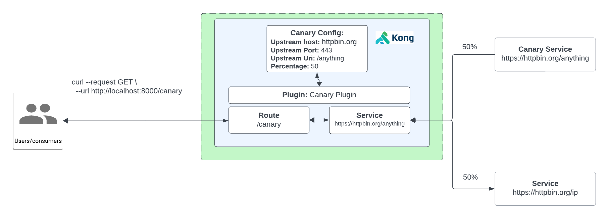

# How to use the Canary Plugin

- [How to use the Canary Plugin](#how-to-use-the-canary-plugin)
  - [What is the Canary?](#what-is-the-canary)
  - [Watch the video on how to use the Canary plugin](#watch-the-video-on-how-to-use-the-canary-plugin)
  - [Installation using Deck](#installation-using-deck)
  - [Installation using Admin API](#installation-using-admin-api)
  - [Installation using KIC](#installation-using-kic)

## What is the Canary?

**Canary Releases:**  Canary requests is a deployment strategy which involve routing a small percentage of incoming traffic to a new or updated version of an API to test its functionality and performance before rolling it out to all users.

**How it works with Konnect**

1. Create a Service and Route
2. Test to see if we can proxy request
3. Enable Kong’s Canary Plugin
4. For the plugin configuration, we will specify a new endpoint to connect to for a certain percentage of the traffic. In this case we will use https://httpbin.org/anything
   - Upstream host: httpbin.org
   - Upstream port: 443
   - Upstream URI: /anything
   - Percentage: 50
   - Steps: 100
   - Hash: none
5. Test to see if 50% of the traffic goes to https://httpbin.org/anything & https://httpbin.org/ip

## Watch the video on how to use the Canary plugin

<!--
[![First [PLUGIN NAME]](./images/activate.png)](https://youtu.be/ "First [PLUGIN NAME]")
-->

## Installation using Deck

To install this using deck:

1. Navigate to this directory
2. Make sure you have deck [installed](https://docs.konghq.com/deck/latest/installation/)
3. Make sure your konnect token is set `export KONNECT_TOKEN=kpat_abcdedf....................yz`
4. Make sure you can connect: `deck ping --konnect-token $KONNECT_TOKEN` should return a successful response `Successfully Konnected to the Kong organization!`
5. Run deck sync: `deck sync --konnect-token $KONNECT_TOKEN --select-tag canary-example`

## Installation using Admin API

You can leverage the insomnia repository [here](https://github.com/irishtek-solutions/kong-konnect-inso) for Admin API usage.

## Installation using KIC

Note: The Canary plugin is not designed for a Kubernetes-native framework, and shouldn’t be used with the Kong Ingress Controller. Instead, use the [Gateway API](https://docs.konghq.com/kubernetes-ingress-controller/latest/concepts/gateway-api/) to manage canary deploys.